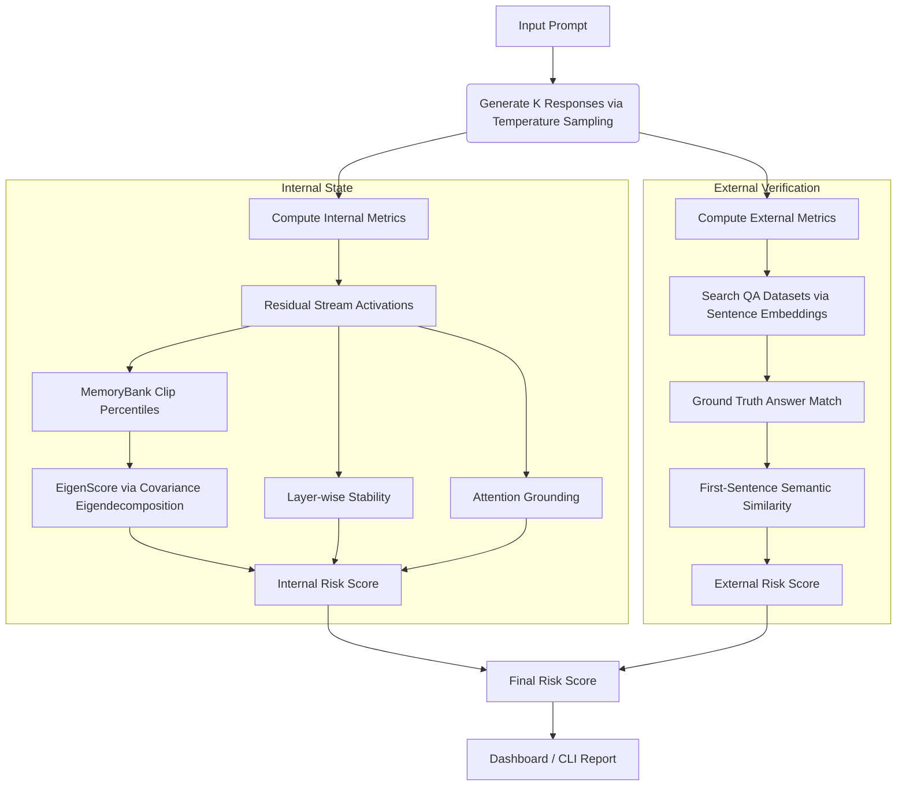

# 🧠 Inside the Mind of an LLM: Hybrid Hallucination Detection System

An advanced, multi-page Python dashboard and CLI framework designed to diagnose and visualize hallucinations in LLM-generated text. The system couples **internal model introspection** (activation-space analysis, representation stability, and attention grounding) with **external factual cross-checking** against benchmark QA datasets.

---

## 🚀 Key Highlights & Features

### 1. Internal Activation Analysis (White-Box Diagnostics)
* **EigenScore (ICLR 2024 - INSIDE Paper):** Captures semantic consistency by performing eigendecomposition on the covariance matrix of hidden states across multiple stochastic generations.
* **Distribution-Aware Feature Clipping:** Implements the `MemoryBank` token-activation cache. Clips activations per feature dimension between the 0.2nd and 99.8th percentiles to eliminate outlier dominance.
* **Layer-wise Stability:** Measures the cosine similarity of hidden state representations between adjacent transformer layers to track representational drift.
* **Attention Grounding:** Analyzes layer-wise attention matrices to verify the proportion of attention generated tokens dedicate back to the prompt tokens.

### 2. External Factual Verification (Black-Box Diagnostics)
* **Aggregated Knowledge Benchmarks:** Automatically fetches, caches, and memory-optimizes question-answer pairs from HuggingFace:
  * **TruthfulQA** (paradigmatic falsehoods)
  * **CoQA** (conversational QA)
  * **SQuAD** (reading comprehension)
  * **NQ Open** (Natural Questions)
  * **TriviaQA** (trivia facts)
* **Semantic Vector Search:** Employs the `all-MiniLM-L6-v2` Sentence-Transformer model to match arbitrary prompts semantically to the closest dataset question.
* **Semantic Consistency Check:** Measures semantic cosine similarity between the model's generated text (prioritizing the first, most relevant sentence) and the ground truth.

### 3. Locally Running Models (Ollama Support)
* Supports local LLMs running via **Ollama** (e.g., `llama3:latest`).
* Automatically resolves models through local Ollama API checks.
* Implements **Proxy Metrics** for black-box models that do not expose activation layers:
  * **Proxy Entropy:** Approximated from generated response-length variations.
  * **Proxy Stability:** Evaluated via pairwise Jaccard token overlap between stochastic responses.
  * **Proxy Grounding:** Calculated via Jaccard intersection of prompt tokens with response tokens.

### 4. Interactive Streamlit Multi-Page UI
* **Analyzer:** Prompt entry, real-time activation caching, and live gauge classifications.
* **Explanation:** Generates a plain-language analysis breakdown summarizing what the numbers mean.
* **Evaluation:** Batch evaluation tool allowing users to run validations over validation sets, plot **ROC Curves**, calculate **AUC**, and display **Confusion Matrices**.
* **Detailed Metrics:** Advanced metrics breakdown featuring a Metric Radar chart and layer-wise stability graphs.
* **Hallucination Heatmap:** A visual matrix highlighting which response, metric, or layer transition contributed most to the hallucination risk.
* **History:** Persists, compares, and exports (CSV/JSON) past runs in the current session.

---

## 📂 Project Structure

```
gllm/
├── ui_pages/                  # Streamlit Multi-page Views
│   ├── page_analyzer.py       # Main analyzer workspace
│   ├── page_explanation.py    # Plain-language explanation dashboard
│   ├── page_evaluation.py     # Batch validation, ROC & Confusion Matrix
│   ├── page_metrics.py        # Radar & layer-stability charts
│   ├── page_history.py        # Session history, comparator & data exports
│   └── page_heatmap.py        # Response-metric & layer transition heatmaps
├── analyzer.py                # Pipeline orchestrator (runs generation and scoring)
├── app.py                     # Streamlit Main App entry point & Styling
├── dataset_loader.py          # HuggingFace datasets loader (capped at 2000 entries)
├── example.py                 # Quick-start demonstration script
├── external_verifier.py       # Exact & semantic QA ground truth matcher
├── install.bat                # Windows setup script (Conda/PIP)
├── internal_metrics.py        # MemoryBank clipping, EigenScore, Stability, Grounding
├── main.py                    # Command Line Interface (CLI)
├── model_loader.py            # HookedTransformer (TransformerLens) loader
├── ollama_loader.py           # Local Ollama client & Proxy metrics generator
├── requirements.txt           # Python library dependencies
└── run_ui.bat                 # Streamlit UI execution script
```

---

## ⚙️ Installation & Setup

### Windows (Quick Install via Anaconda)
1. Open the **Anaconda Prompt**.
2. Navigate to the project folder.
3. Run the installation batch script:
   ```cmd
   install.bat
   ```
   *This script handles PyTorch installation (CPU-only version) via Conda, and dependencies via PIP.*

### Manual Install
If you prefer setting up the environment manually:
```bash
pip install -r requirements.txt
```

---

## 🖥️ Usage

### Option 1: Streamlit Dashboard (Recommended)
Launch the interactive web UI using the Windows batch script:
```cmd
run_ui.bat
```
Or run the Streamlit command directly:
```bash
streamlit run app.py
```
Open [http://localhost:8501](http://localhost:8501) in your browser.

* **Configure Weights:** Tweak risk coefficients ($\alpha$ and $\beta$) and metric weights ($w_1$, $w_2$, $w_3$) inside the sidebar in real time.
* **Choose Models:** Swap between `gpt2`, `gpt2-medium`, `gpt2-large`, `EleutherAI/gpt-neo-125M`, `EleutherAI/gpt-neo-1.3B`, `EleutherAI/pythia-2.8b`, and others.

---

### Option 2: Command Line Interface (CLI)
Query the model and return a formatted output summary directly to your terminal:
```bash
python main.py --prompt "What is the capital of Australia?" --num-responses 5 --model gpt2
```

#### CLI Parameters:
* `--prompt`: Input query string (Required unless using dataset).
* `--use-dataset`: Run evaluation consecutively on the TruthfulQA validation set.
* `--model`: Supported TransformerLens variant (default: `gpt2`).
* `--num-responses`: Number of stochastic responses generated to build covariance (default: `5`).
* `--max-length`: Maximum new tokens to generate (default: `50`).
* `--temperature`: Temperature parameter for sampling (default: `0.8`).
* `--alpha`: Weight allocated to the Internal Risk Score (default: `0.6`).
* `--beta`: Weight allocated to the External Risk Score (default: `0.4`).
* `--semantic-threshold`: Cosine similarity cutoff to retrieve question matches (default: `0.80`).

---

### Option 3: Run Quick Example Script
To test your installation with a fast setup check:
```bash
python example.py
```
This runs a sample analysis for `"What is the capital of France?"` and saves an `example_eigenvalue_spectrum.png` plot.

---

## 🧮 How It Works & Metrics



### Risk Level Classifications
The final hallucination risk score scales from `0.0` (confident truth) to `1.0` (high certainty of hallucination):
* **Final Risk < 0.3**: **LOW** — Response appears reliable.
* **Final Risk 0.3–0.6**: **MEDIUM** — Response may contain uncertainties.
* **Final Risk > 0.6**: **HIGH** — Response likely contains hallucinations.

### Mathematical Formulations

#### 1. Internal Risk Formulation
$$\text{Internal Risk} = w_1 \cdot \text{Normalized EigenScore} + w_2 \cdot (1 - \text{Stability}) + w_3 \cdot (1 - \text{Grounding})$$

* **Normalized EigenScore:** Eigendecomposition is run on the regularized covariance matrix $\Sigma = Z_{centered} Z_{centered}^T + \alpha I$ of L2-normalized middle-layer activations. The resulting eigenvalues $\lambda_i$ are used to compute:
  $$\text{EigenScore} = \frac{1}{K} \sum_{i=1}^K \log(\lambda_i)$$
  This score is then passed through a standard sigmoid mapping it to $[0, 1]$.
* **Stability:** Cosine similarity of residual stream hidden vectors between adjacent layers.
* **Grounding:** Percentage of attention heads that focus attention back onto prompt tokens during response token generation.

#### 2. External Risk Formulation
$$\text{External Risk} = 1 - \text{External Consistency}$$

* **External Consistency:** The average semantic similarity between the generated responses and the retrieved ground-truth answer. To prevent length penalties for detailed model answers, the similarity checks the maximum of both the full response and the first sentence.

#### 3. Hybrid Hallucination Risk Score
$$\text{Final Risk} = \alpha \cdot \text{Internal Risk} + \beta \cdot \text{External Risk}$$
*(Where default $\alpha = 0.6$, $\beta = 0.4$, and $\alpha + \beta = 1.0$)*

---

## 📝 License
This project is licensed under the **MIT License**.
